<p align="center">
  
</p>

<h1 align="center">Place XP — Official Club Web Platform</h1>

<p align="center">
  <b>The official placement-focused technical developer community and event management platform of VIT Chennai.</b>
</p>

<p align="center">
  <a href="https://nextjs.org"></a>
  <a href="https://react.dev"></a>
  <a href="https://www.typescriptlang.org/"></a>
  <a href="https://tailwindcss.com/"></a>
  <a href="https://supabase.com"></a>
  <a href="https://gsap.com"></a>
</p>

---

## 📑 Table of Contents

- [Overview](#-overview)
- [Key Features](#-key-features)
- [Visual Showcase & Screenshots](#-visual-showcase--screenshots)
  - [Landing Experience](#landing-experience)
  - [Core Community & Offerings](#core-community--offerings)
  - [Dedicated Portals & Administration](#dedicated-portals--administration)
- [System Architecture](#-system-architecture)
  - [High-Level Architectural Diagram](#high-level-architectural-diagram)
  - [User Journey & Data Flow](#user-journey--data-flow)
  - [Database Schema & ER Model](#database-schema--er-model)
- [Design System & UI/UX Philosophy](#-design-system--uiux-philosophy)
- [Tech Stack](#-tech-stack)
- [Project Directory Structure](#-project-directory-structure)
- [Getting Started](#-getting-started)
  - [Prerequisites](#prerequisites)
  - [Installation](#installation)
  - [Environment Configuration](#environment-configuration)
  - [Database Setup & Migrations](#database-setup--migrations)
  - [Running the Application](#running-the-application)
- [Role-Based Access Control (RBAC)](#-role-based-access-control-rbac)
- [Deployment](#-deployment)
- [Contributing](#-contributing)

---

## 🌟 Overview

**Place XP** is VIT Chennai's premier placement-focused technical student community. Designed with a startup-grade UI/UX ethos inspired by Linear, Stripe, GitHub Education, and Vercel, this platform serves as the central digital ecosystem for students, organizers, faculty, and recruiters.

The platform provides:
- **Immersive Landing Portal**: High-performance interactive landing experience with dynamic WebGL ferrofluid animations, glassmorphic UI, and smooth Lenis scrolling.
- **Event Lifecycle & Registration Engine**: End-to-end event discovery, multi-tier participant registration, live countdowns, document/presentation submission, and real-time status tracking.
- **Recruitment Management Hub**: Comprehensive pipeline showcasing recruitment phases, department overviews, applicant screening, and structured onboarding.
- **Admin Command Center**: Role-protected management console for club leadership to manage announcements, event schedules, task boards, uploaded resources, and participant analytics.

---

## ✨ Key Features

| Feature | Description |
| :--- | :--- |
| **🎨 Dark-First Design System** | Engineered with deep midnight blues (`#07111F`, `#0D1B2A`), high-contrast typography, and radiant orange accents (`#F89A4A`). |
| **🌊 WebGL Ferrofluid & Smooth Motion** | Custom interactive OGL/WebGL canvas backgrounds, GSAP-powered motion orchestration, and Lenis virtual smooth scrolling. |
| **🧭 Gooey Floating Navigation** | Dynamic scroll-spy navigation bar with active section highlight, glassmorphism backdrop blur, and responsive mobile drawer. |
| **🎟️ Live Event Registrations** | Supabase-backed event registration engine supporting presentation uploads, submission tracking, and instant confirmations. |
| **📊 Impact & Metric Counters** | Animated viewport-triggered counters showcasing club statistics (250+ members, 45+ events, 100+ placements). |
| **🖼️ Interactive Bento & Masonry Gallery** | Multi-media gallery showcasing club hackathons, workshop recordings, competition memories, and campus events. |
| **👥 Leadership & Team Directory** | Complete team index displaying Faculty Coordinators, Club Leads, Technical Heads, and social connectivity. |
| **🛡️ Enterprise-Grade Auth & RLS** | Role-based authentication (Admin vs. Participant) enforced via Supabase SSR and PostgreSQL Row-Level Security policies. |
| **📁 Hybrid Storage & Upload Server** | Dual storage support: cloud object storage alongside an integrated Express & Multer file upload service. |

---

## 📸 Visual Showcase & Screenshots

### Landing Experience

#### 1. Hero Section & Interactive WebGL Canvas
> Immersive landing hero with custom ferrofluid physics, animated typography, and quick call-to-actions.

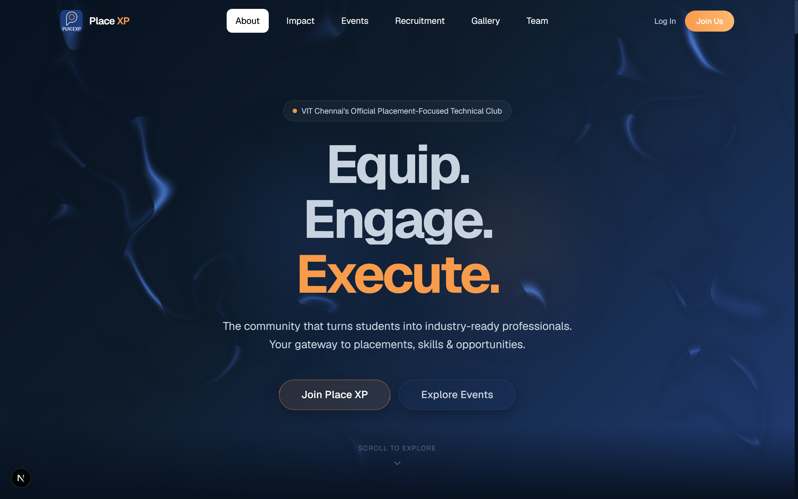

---

#### 2. About Place XP & Impact Metrics
> Highlights the club's core mission, placement training curriculum, and real-time impact metrics.

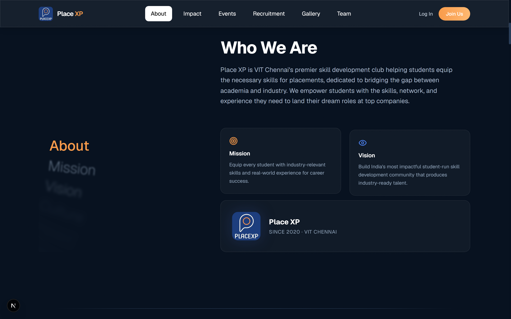

---

### Core Community & Offerings

#### 3. Core Pillars & Why Join Place XP
> Interactive feature cards highlighting Technical Learning, Hackathons, Projects, Industry Exposure, Networking, and Leadership.

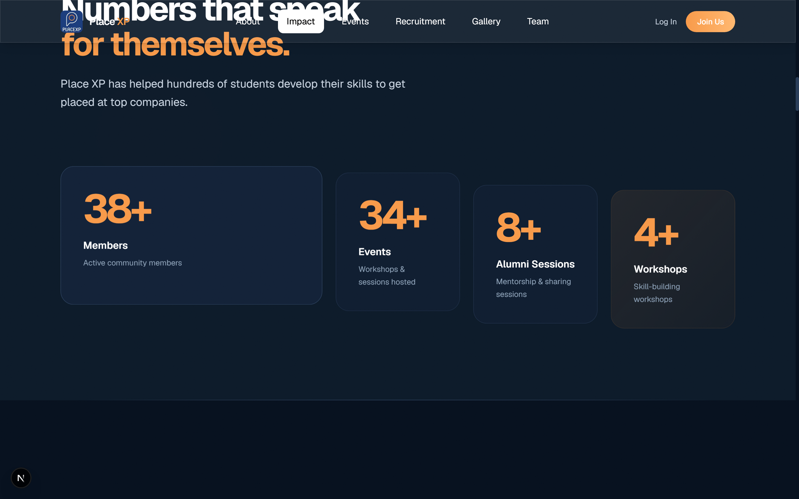

---

#### 4. Featured Events & Workshops
> Live catalog of upcoming placement bootcamps, technical workshops, and coding challenges.

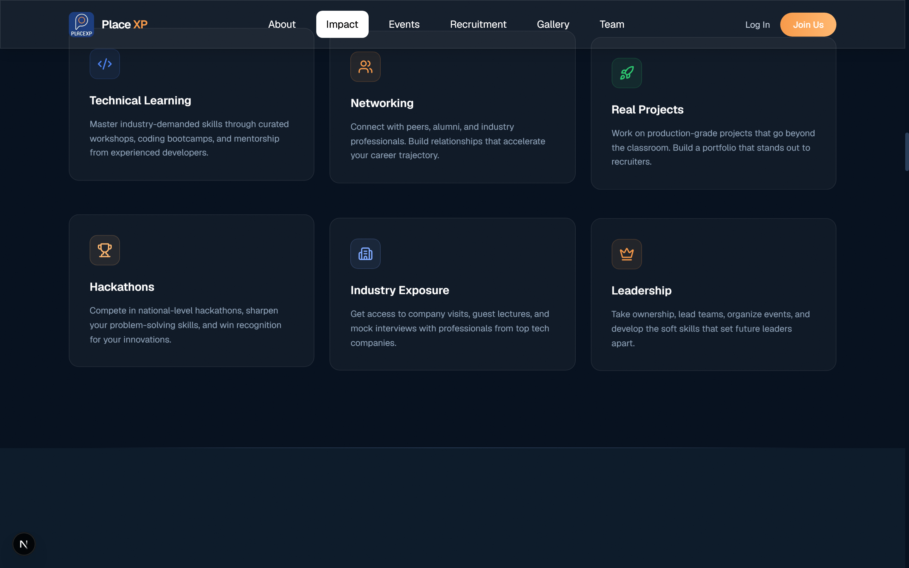

---

#### 5. Recruitment Journey & Selection Timeline
> Interactive recruitment roadmap guiding applicants from application submission to final onboarding.

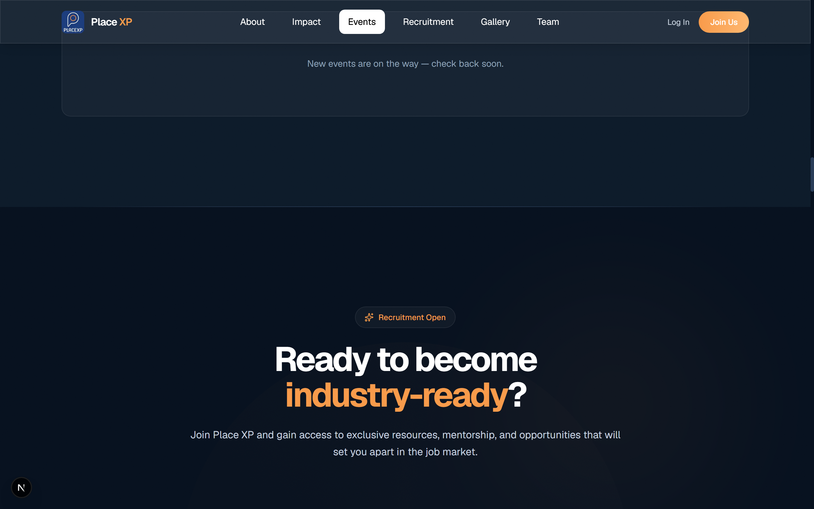

---

#### 6. Dynamic Media Gallery & Core Leadership Preview
> Interactive visual mosaic of workshops, hackathons, and executive leadership cards.

| Gallery Showcase | Leadership Preview |
| :---: | :---: |
| 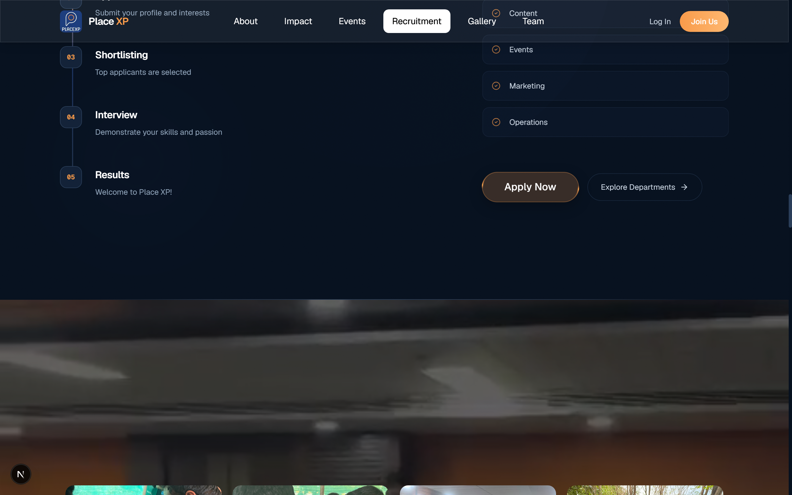 | 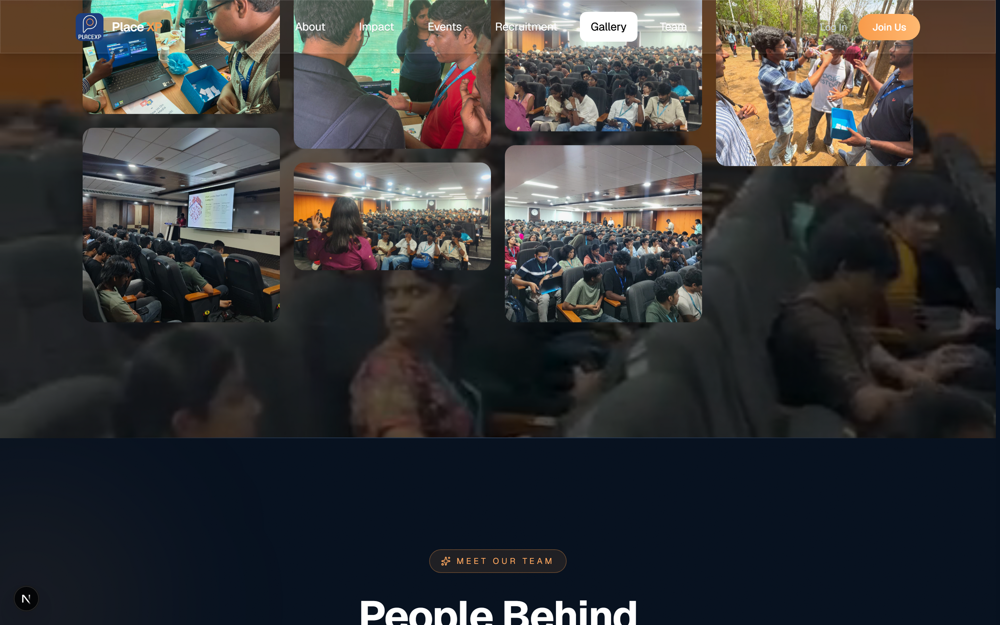 |

---

### Dedicated Portals & Administration

| Dedicated Events Portal (`/events`) | Dedicated Team Directory (`/team`) |
| :---: | :---: |
| 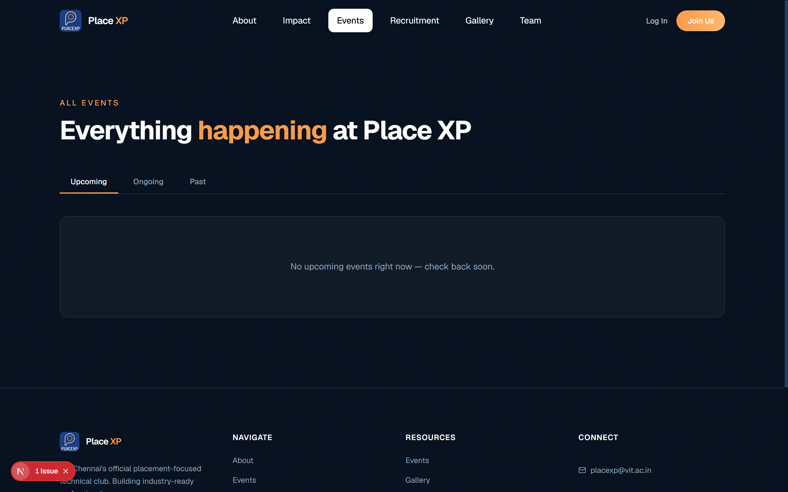 | 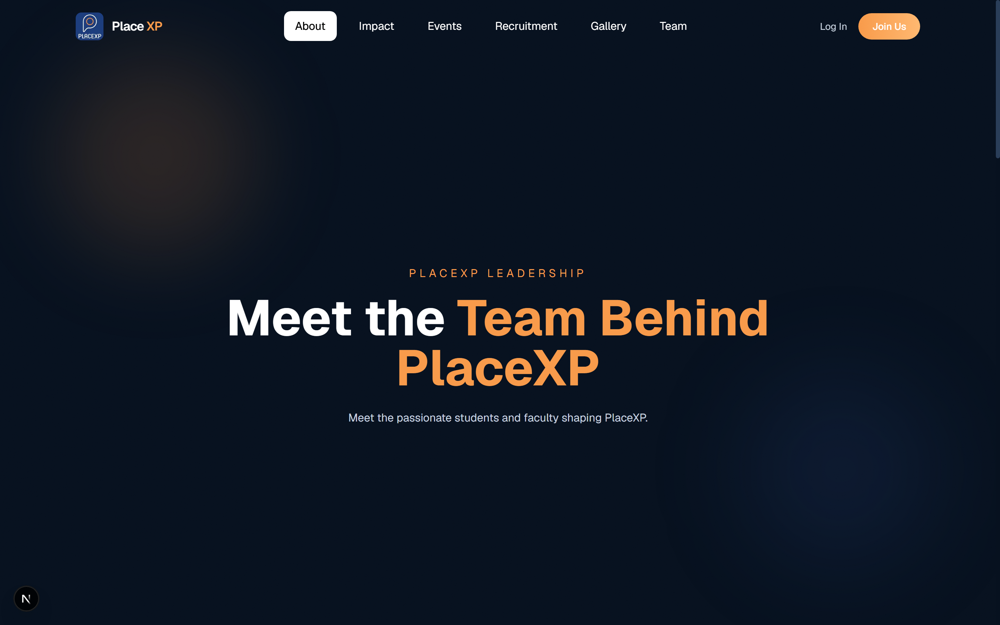 |

| Interactive Gallery (`/gallery`) | Authentication & Portal Access (`/login`) |
| :---: | :---: |
| 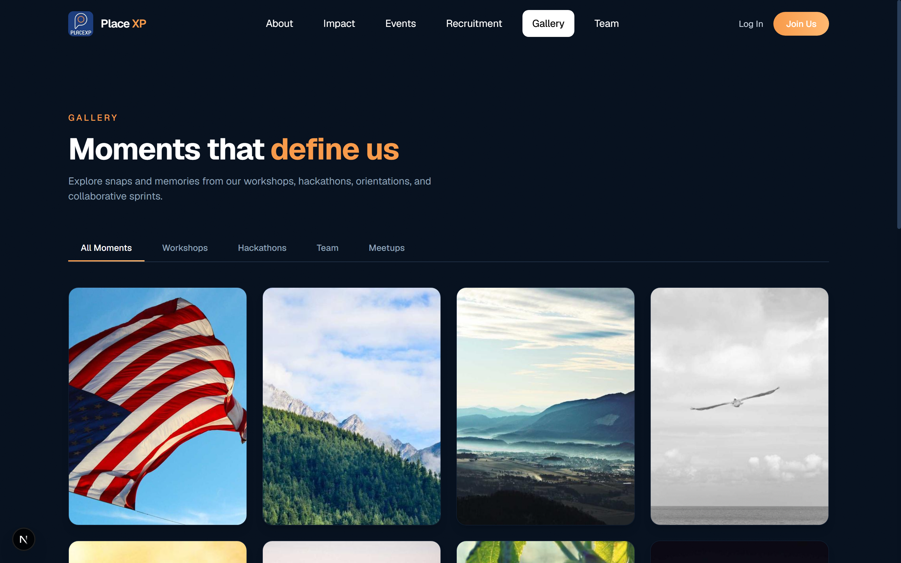 | 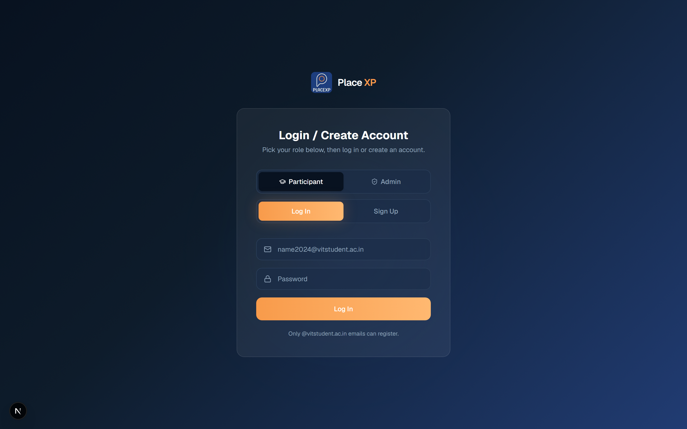 |

#### Role-Based Admin Command Center (`/admin`)
> Central control dashboard for event creation, registration approval, resource uploads, and task management.

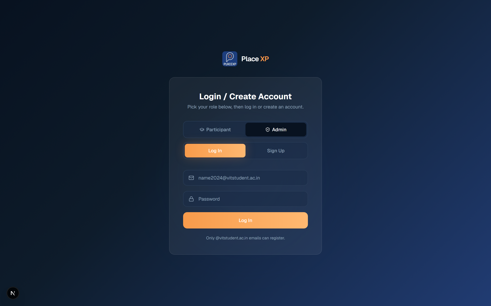

---

## 🏗️ System Architecture

### High-Level Architectural Diagram

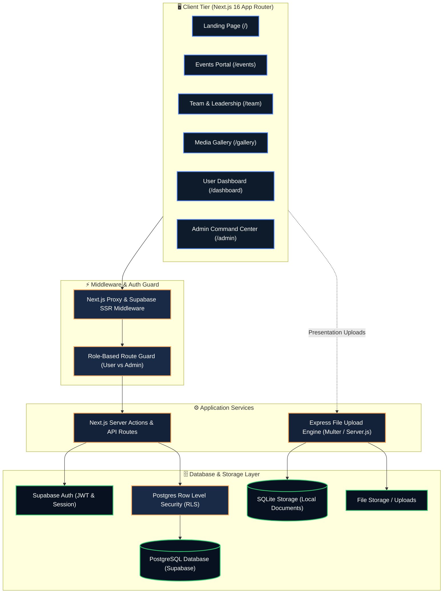

---

### User Journey & Data Flow

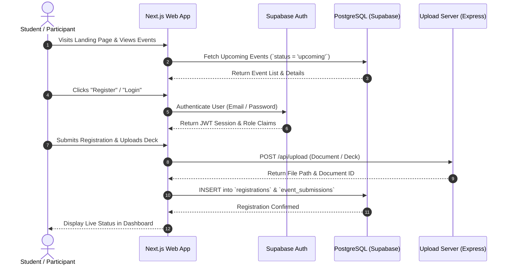

---

### Database Schema & ER Model

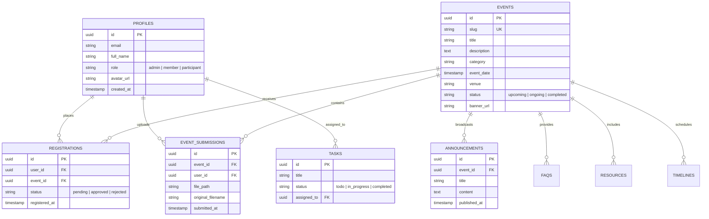

---

## 🎨 Design System & UI/UX Philosophy

The design system adheres to a strict, restrained palette designed for high aesthetic cohesion, dark-mode elegance, and readability.

### Color Palette

| Token | Hex Value | Preview | Usage |
| :--- | :---: | :---: | :--- |
| **Main Background** | `#07111F` | `⬛` | Root viewport background |
| **Secondary Background** | `#0D1B2A` | `⬛` | Alternate sections & nested cards |
| **Card Background** | `#132238` | `⬛` | Primary interactive cards & containers |
| **Elevated Surface** | `#182A45` | `⬛` | Hover states, modals, floating navbar |
| **Brand Primary Blue** | `#29498B` | `🟦` | Primary brand accent & secondary buttons |
| **Accent Orange** | `#F89A4A` | `🟧` | Primary CTAs, highlights, active states |
| **Orange Hover** | `#FFAA5C` | `🟧` | Hover transitions on primary actions |
| **Primary Text** | `#FFFFFF` | `⬜` | High-emphasis headings and labels |
| **Secondary Text** | `#C8D3E0` | `◻️` | Body text, descriptions, subheadings |
| **Muted Text** | `#8EA2B8` | `◻️` | Captions, timestamps, disabled states |

### Design Tokens & Effects
- **Hero Gradient**: `linear-gradient(135deg, #07111F 0%, #0D1B2A 40%, #203B72 100%)`
- **Action CTA Gradient**: `linear-gradient(90deg, #F89A4A, #FFB870)`
- **Glassmorphism Backdrop**: `background: rgba(255, 255, 255, 0.04); backdrop-filter: blur(16px); border: 1px solid rgba(255, 255, 255, 0.08);`
- **Accent Glows**: `0 0 30px rgba(248, 154, 74, 0.25)`

---

## 💻 Tech Stack

### Frontend & UI
- **[Next.js 16 (App Router)](https://nextjs.org/)** — Server-side rendering, React Server Components, Turbopack, and API route routing.
- **[React 19](https://react.dev/)** — Declarative modern user interface library.
- **[TypeScript 5](https://www.typescriptlang.org/)** — End-to-end static type safety.
- **[Tailwind CSS v4](https://tailwindcss.com/)** — Utility-first styling engine.
- **[Lucide React](https://lucide.dev/)** — Scalable icon system.

### Motion & Creative WebGL
- **[OGL](https://github.com/oframe/ogl)** — Minimal WebGL library powering the interactive ferrofluid visual canvas.
- **[GSAP (GreenSock)](https://gsap.com/)** — High-performance scroll triggers and timeline animations.
- **[Lenis](https://lenis.darkroom.engineering/)** — Smooth virtual scrolling integration.
- **[Motion (Framer Motion)](https://motion.dev/)** — Component transitions and layout animations.

### Backend & Database
- **[Supabase](https://supabase.com/)** — Managed PostgreSQL database, JWT authentication, and Row-Level Security policies.
- **[@supabase/ssr](https://github.com/supabase/auth-helpers)** — Modern cookie-based session management across Next.js Server Components.
- **[Express.js](https://expressjs.com/) & [Multer](https://github.com/expressjs/multer)** — Dedicated local file upload handler for presentation submissions.
- **[SQLite3](https://www.sqlite.org/)** — Lightweight database for file upload metadata.

---

## 📁 Project Directory Structure

```text
place-xp/
├── logo.png                       # Official Place XP club logo
├── PRD.MD                         # Product Requirements Document
├── color.md                       # Official Brand Color & Design System
├── COMPONENTS.md                  # Component Catalog & Specifications
├── server.js                      # Express File Upload Engine (Multer + SQLite)
├── package.json                   # Root package configuration
│
├── docs/                          # Documentation & Assets
│   └── screenshots/               # High-resolution screenshots of all views
│       ├── 01_hero.png
│       ├── 02_about_impact.png
│       ├── 03_why_join.png
│       ├── 04_featured_events.png
│       ├── 05_recruitment.png
│       ├── 06_gallery_preview.png
│       ├── 07_team_preview.png
│       ├── 08_events_page.png
│       ├── 09_team_page.png
│       ├── 10_gallery_page.png
│       ├── 11_login_page.png
│       └── 12_admin_portal.png
│
└── club-site/                     # Next.js 16 Frontend Application
    ├── app/                       # Next.js App Router
    │   ├── page.tsx               # Primary Landing Page
    │   ├── layout.tsx             # Root Application Layout & Providers
    │   ├── globals.css            # Global CSS & Tailwind Theme Directives
    │   ├── login/                 # Authentication Portal
    │   ├── events/                # Dedicated Events Catalog & Detail View
    │   │   └── [slug]/            # Dynamic Event Page (`/events/[slug]`)
    │   ├── team/                  # Full Team & Leadership Directory
    │   ├── gallery/               # Full Interactive Masonry Gallery
    │   ├── dashboard/             # Student Dashboard & Submission Tracker
    │   │   └── events/[slug]/     # Event-specific dashboard
    │   └── admin/                 # Role-Protected Admin Command Center
    │       ├── events/            # Event creation and editing
    │       ├── participants/      # Participant management
    │       ├── registrations/     # Registration approvals
    │       ├── announcements/     # Announcement broadcaster
    │       ├── resources/         # Resource link manager
    │       ├── tasks/             # Leadership Kanban board
    │       └── settings/          # Global site configuration
    │
    ├── components/                # Modular React Components
    │   ├── sections/              # Landing Page Sections (Hero, About, WhyJoin, etc.)
    │   ├── reactbits/             # Interactive Canvas & Animation Components
    │   ├── admin/                 # Admin CMS Editor & Table Components
    │   ├── dashboard/             # User Dashboard Views & Widgets
    │   ├── events/                # Event Cards, Modals, & File Uploads
    │   ├── auth/                  # Login & Signup Form Components
    │   └── providers/             # Global Providers (Lenis, Theme, etc.)
    │
    ├── lib/                       # Utilities & Server Clients
    │   └── supabase/              # Supabase Client, Server, and Middleware handlers
    │
    ├── supabase/                  # Database Schemas & Migrations
    │   ├── schema.sql             # Base PostgreSQL database schema
    │   ├── step6-role-based-auth.sql
    │   ├── step8-rls-policies.sql
    │   ├── step10-bootstrap-first-admin.sql
    │   └── migrations/            # Versioned SQL migration scripts
    │
    ├── types/                     # TypeScript Interfaces & Database Types
    └── public/                    # Static Assets (Images, Team, Media)
```

---

## 🚀 Getting Started

### Prerequisites
Make sure you have the following installed on your development machine:
- **Node.js**: `v18.18.0` or higher (recommended: `v20.x` or `v24.x`)
- **npm**, **pnpm**, or **yarn**
- **Git**

---

### Installation

1. **Clone the repository**:
   ```bash
   git clone https://github.com/Shivasomesh-cpu/place-xp.git
   cd place-xp
   ```

2. **Install Frontend Dependencies**:
   ```bash
   cd club-site
   npm install
   ```

3. **Install Upload Server Dependencies (Optional for local deck submission)**:
   ```bash
   cd ..
   npm install express multer sqlite3 cors
   ```

---

### Environment Configuration

In the `club-site` directory, create a `.env.local` file:

```bash
cd club-site
cp .env.example .env.local
```

Populate `.env.local` with your Supabase credentials:

```env
# Supabase API Keys (Find these in Project Settings -> API)
NEXT_PUBLIC_SUPABASE_URL=https://your-project-id.supabase.co
NEXT_PUBLIC_SUPABASE_ANON_KEY=your-anon-public-key
```

---

### Database Setup & Migrations

If configuring a new Supabase project:
1. Open your [Supabase SQL Editor](https://supabase.com/dashboard).
2. Execute the scripts located in `club-site/supabase/` in sequential order:
   - `schema.sql` — Creates base tables (`profiles`, `events`, `registrations`, `announcements`, `faqs`, `resources`).
   - `step6-role-based-auth.sql` — Establishes role triggers on new user signup.
   - `step8-rls-policies.sql` — Enforces Row Level Security (RLS).
   - `step10-bootstrap-first-admin.sql` — Sets your primary admin user email.
   - `migrations/20240320000000_add_event_submissions.sql` — Enables presentation document submissions.

---

### Running the Application

#### 1. Start the Next.js Frontend
```bash
cd club-site
npm run dev
```
Open [http://localhost:3000](http://localhost:3000) in your browser.

#### 2. Start the Local Upload Engine (Optional)
```bash
# In the root directory
node server.js
```
The upload server will listen on `http://localhost:3000` (or designated port).

---

## 🔒 Role-Based Access Control (RBAC)

The platform enforces strict authorization tiers:

```text
┌─────────────────────────────────────────────────────────────┐
│                       Visitor / Guest                       │
│  - View landing page, public events, team, and gallery      │
└──────────────────────────────┬──────────────────────────────┘
                               │ Authenticates
┌──────────────────────────────▼──────────────────────────────┐
│                    Registered Participant                   │
│  - Register for events & upload presentation decks          │
│  - Access personal student dashboard (/dashboard)           │
│  - View registered event materials & meeting links          │
└──────────────────────────────┬──────────────────────────────┘
                               │ Admin Role Granted
┌──────────────────────────────▼──────────────────────────────┐
│                      Club Administrator                     │
│  - Access Admin Command Center (/admin)                     │
│  - Create, update, and publish events                       │
│  - Approve or reject participant registrations              │
│  - Broadcast announcements, manage resources, and tasks     │
└─────────────────────────────────────────────────────────────┘
```

---

## 🚢 Deployment

### Deploying to Vercel

1. Push your repository to GitHub.
2. Import the repository into [Vercel](https://vercel.com/new).
3. Set the **Root Directory** to `club-site`.
4. Configure the environment variables:
   - `NEXT_PUBLIC_SUPABASE_URL`
   - `NEXT_PUBLIC_SUPABASE_ANON_KEY`
5. Click **Deploy**.

---

## 🤝 Contributing

Contributions are welcome to make Place XP even better!

1. Fork the Project.
2. Create your Feature Branch (`git checkout -b feature/AmazingFeature`).
3. Commit your Changes (`git commit -m 'feat: Add some AmazingFeature'`).
4. Push to the Branch (`git push origin feature/AmazingFeature`).
5. Open a Pull Request.
